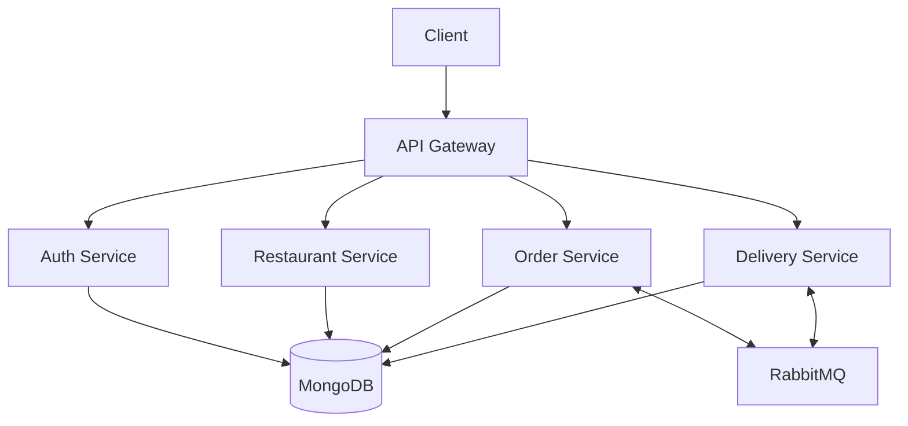

# 🚀 Food Delivery Microservices

[](https://www.typescriptlang.org/)
[](https://nodejs.org/)
[](https://www.mongodb.com/)
[](https://www.rabbitmq.com/)
[](https://www.docker.com/)

> 🌟 A modern, scalable food delivery platform built with microservices architecture

## 📑 Table of Contents

- [✨ Features](#-features)
- [🏗️ Architecture](#️-architecture)
- [🛠️ Tech Stack](#️-tech-stack)
- [🚀 Getting Started](#-getting-started)
- [📚 API Documentation](#-api-documentation)
- [🔧 Development](#-development)
- [🤝 Contributing](#-contributing)
- [📝 License](#-license)

## ✨ Features

### 🔐 Auth Service
- Secure user authentication with JWT
- Role-based access control (RBAC)
- Password encryption & validation
- Session management

### 🍽️ Restaurant Service
- Restaurant profile management
- Menu & category management
- Real-time availability updates
- Operating hours management
- Order capacity control

### 📦 Order Service
- Smart order processing
- Real-time status tracking
- Payment integration
- Order history & analytics
- Special instructions handling

### 🛵 Delivery Service
- Intelligent courier assignment
- Real-time delivery tracking
- Route optimization
- Delivery status updates
- Courier availability management

### 🌐 API Gateway
- Smart request routing
- Load balancing
- Rate limiting
- Service discovery
- Request/Response transformation

## 🏗️ Architecture



## 🛠️ Tech Stack

| Category | Technologies |
|----------|-------------|
| 🔧 Core | Node.js, TypeScript |
| 📦 Database | MongoDB |
| 🔄 Message Broker | RabbitMQ |
| 🔒 Authentication | JWT |
| 📚 Documentation | Postman |
| 🐳 Containerization | Docker |
| 🧪 Testing | Jest |

## 🚀 Getting Started

### Prerequisites

Before you begin, ensure you have the following installed:
- Node.js (v16+)
- MongoDB
- RabbitMQ
- Docker (optional)

### 🔧 Installation

1. **Clone the repository**
   ```bash
   git clone <repository-url>
   cd Food_delivery_MS
   ```

2. **Set up environment variables**
   ```bash
   # Create .env files in each service directory
   cp .env.example .env
   ```

3. **Install dependencies**
   ```bash
   # Install dependencies for all services
   npm run install-all
   ```

4. **Start the services**

   Using Docker:
   ```bash
   docker-compose up
   ```

   Without Docker:
   ```bash
   # Start all services
   npm run dev
   ```

## 📚 API Documentation

### 🔑 Authentication Endpoints
\`\`\`http
POST /api/auth/register
POST /api/auth/login
GET /api/auth/profile
\`\`\`

### 🍽️ Restaurant Endpoints
\`\`\`http
GET /api/restaurants
POST /api/restaurants
GET /api/restaurants/:id/menu
\`\`\`

### 📦 Order Endpoints
\`\`\`http
POST /api/orders
GET /api/orders/:id
PATCH /api/orders/:id/status
\`\`\`

### 🛵 Delivery Endpoints
\`\`\`http
GET /api/delivery/tracking/:id
PATCH /api/delivery/:id/status
GET /api/delivery/couriers
\`\`\`

## 🔧 Development

### Project Structure
```
Food_delivery_MS/
├── 🔐 auth/
├── 🍽️ restaurant/
├── 📦 order/
├── 🛵 delivery/
├── 🌐 gateway/
├── 📚 postman/
└── 📝 README.md
```

### Service Structure
```
service/
├── src/
│   ├── app.ts
│   ├── *.controller.ts
│   ├── *.service.ts
│   ├── *.model.ts
│   ├── *.routes.ts
│   ├── *.middleware.ts
│   └── types/
└── package.json
```

### 🧪 Running Tests
```bash
# Run all tests
npm run test

# Run specific service tests
npm run test:auth
npm run test:order
npm run test:delivery
npm run test:restaurant
```

## 🤝 Contributing

1. Fork the repository
2. Create your feature branch
   ```bash
   git checkout -b feature/amazing-feature
   ```
3. Commit your changes
   ```bash
   git commit -m '✨ Add some amazing feature'
   ```
4. Push to the branch
   ```bash
   git push origin feature/amazing-feature
   ```
5. Open a Pull Request

## 📝 License

This project is licensed under the MIT License - see the [LICENSE](LICENSE) file for details.

---

<div align="center">
  <strong>Built with ❤️ by Yasin </strong>
  <br>
  <br>
  <a href="https://github.com/yourusername">
    
  </a>
</div>
